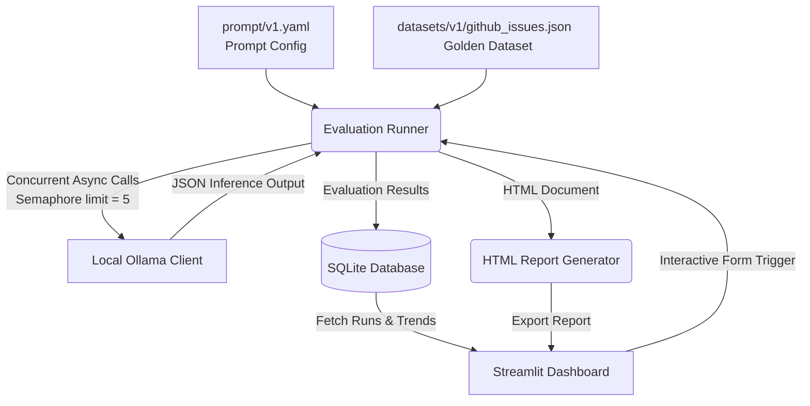
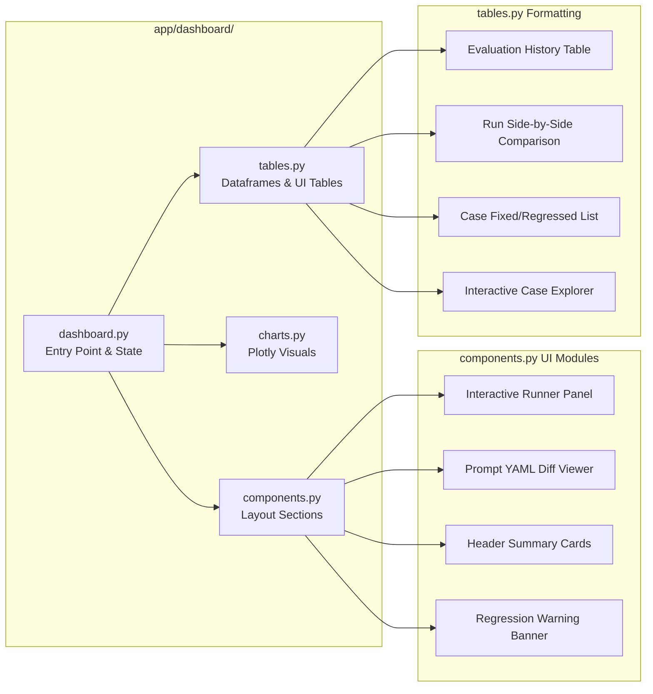

# PromptOps 🤖

An automated LLM Prompt Evaluation & Regression Detection platform. Define prompts as code, evaluate LLM outputs against a golden dataset locally with Ollama, compare prompt versions, and track performance changes using a clean Streamlit dashboard.

---

## Architecture & Workflows

### 1. Prompt Evaluation Flow
This diagram illustrates how configuration inputs flow through the asynchronous evaluation engine to persist results and alert you of performance regression.



### 2. Modular Dashboard Structure
To prevent a single massive codebase file, the Streamlit dashboard is split into focused components:



---

## Core Concepts

### 📂 Golden Datasets
A **Golden Dataset** (e.g., [github_issues.json](file:///c:/ALLMLPROJ/MAINMLPROJS/PromptOps/datasets/v1/github_issues.json)) is a curated set of test inputs paired with their target/expected outputs. It represents the ground-truth standard that your prompt must satisfy. During evaluation, the system executes your prompt on every input case and validates whether the LLM's classification matches the golden case category.

### 🚨 Regression Tracking
Every evaluation run saves its total cases, passed cases, failed cases, and overall accuracy percentage in `data/evaluation.db`. 
When you write a new prompt version (e.g., `v2`), PromptOps compares the accuracy of the latest run against the preceding run:
* **Improved**: The new prompt increased classification accuracy.
* **Unchanged**: Accuracy remained consistent.
* **Regression**: Accuracy dropped, indicating that your changes broke previously working cases. The dashboard highlights exactly which inputs went from passing to failing (`🟢 Fixed` vs `🔴 Regressed`).

---

## Installation & Setup

### 1. Prerequisites
* **Python 3.11+** installed.
* **Ollama** installed and running on your system. Download it from [ollama.com](https://ollama.com).
* **LLM Model**: Download the model specified in the default prompt configuration:
  ```bash
  ollama pull gemma3:4b
  ```

### 2. Environment Activation & Dependencies
Activate the project's virtual environment and install the required modules:
```powershell
# Activate on Windows
.venv\Scripts\activate

# Install dependencies
.venv\Scripts\python -m pip install -r requirements.txt
```

---

## How to Run

### 1. Run Evaluations via Terminal CLI
Run the automated pipeline to benchmark the current prompt:
```bash
.venv\Scripts\python -m scripts.test_runner
```
This prints result summaries in your console and generates a report webpage in the `reports/` folder.

### 2. Start the Streamlit Dashboard UI
Run the web dashboard to visualize histories, compare prompt outputs, view YAML diffs, and run evaluations:
```bash
.venv\Scripts\streamlit run app/dashboard/dashboard.py
```
Access the dashboard at [http://localhost:8501](http://localhost:8501).

### 3. Start the FastAPI Production Server
To spin up the API gateway exposing prompt classification endpoint:
```bash
.venv\Scripts\uvicorn main:app --reload
```
You can query the API using any HTTP client:
```bash
curl -X POST http://127.0.0.1:8000/infer/ \
     -H "Content-Type: application/json" \
     -d '{"title": "Cannot login", "body": "Invalid credentials after password reset"}'
```

### 4. Running Unit Tests (Optional)
If you set up unit tests inside a `tests` directory in the future, you can execute them using:
```bash
.venv\Scripts\python -m unittest discover -s tests
```

## Detailed User Guide (How to Use PromptOps)

Follow these steps to set up, test, and iterate on your own LLM prompts:

### Step 1: Create Your Prompt Configuration
Your prompt configurations reside in the `prompt/` directory. Each prompt version is a YAML file.
Create a new configuration file (e.g., `prompt/v1.yaml`) with the following format:
```yaml
version: "v1"
name: "My Task Classifier"
model: "gemma3:4b"  # Specify any model you have pulled in Ollama
temperature: 0.0     # 0.0 is recommended for deterministic evaluation results
max_tokens: 150

system_prompt: |
  You are an expert classification assistant. Classify the user input into: bug, feature-request, or support.
  Return only a JSON object: {"category": "bug | feature-request | support", "priority": "low | medium | high", "summary": "One sentence summary"}

user_prompt_template: |
  User Input: {title}
  Details: {body}

output_schema:
  category: string
  priority: string
  summary: string

metadata:
  author: "Developer"
  description: "Initial prompt setup"
  created_at: "2026-08-17"
```

### Step 2: Prepare Your Golden Dataset
Your test cases are defined in a JSON file inside the `datasets/` directory (e.g., `datasets/v1/my_cases.json`). 
Each dataset contains test cases matching your schema format:
```json
{
  "version": "v1",
  "description": "Golden test cases for classification",
  "created_at": "2026-08-17",
  "cases": [
    {
      "id": "CASE_001",
      "input": {
        "title": "Application crashes on load",
        "body": "Whenever I launch the app, it closes immediately without showing any error screen."
      },
      "expected": {
        "category": "bug",
        "priority": "high",
        "summary": "Application crashes instantly on launch."
      },
      "metadata": {
        "difficulty": "easy",
        "tags": ["crash", "critical"],
        "notes": "Standard crash case."
      }
    }
  ]
}
```

### Step 3: Run the Evaluation
You have two ways to execute your test run:
* **Option A (Terminal CLI)**: Update the file paths in `scripts/test_runner.py` and run:
  ```bash
  .venv\Scripts\python -m scripts.test_runner
  ```
* **Option B (Dashboard UI)**: Open the Streamlit dashboard, locate the **⚡ Run New Evaluation** section at the top, select your prompt file and dataset, and click **🚀 Start Evaluation Run**.

### Step 4: Visualizing & Comparing Runs
Once a run completes, open the Streamlit dashboard:
1. **View Latest Metrics**: Check overall accuracy, passed cases vs. failed cases, and the run metadata at the top.
2. **Review Run History**: Scroll down to see the historical runs and the **Accuracy Trend Chart** tracking performance over time.
3. **Compare Run Performance**:
   * Set the sidebar **Choose Run** to your latest version (e.g., `Run 2`).
   * Set the sidebar **Compare With** to your baseline version (e.g., `Run 1`).
   * View the **Run Comparison** table to see differences in metrics.
   * View the **Prompt Diff Viewer** showing exactly what lines in your YAML prompt changed.
   * Check the **Case-by-Case Comparison** to see which test cases were `🟢 Fixed` or `🔴 Regressed` (went from pass to fail).

### Step 5: Triage and Fix Failures
1. Look at the **Case Explorer** at the bottom of the dashboard.
2. Review cases marked with `❌ FAIL`.
3. Check the **Predicted** value vs. **Expected** value to understand where the model failed.
4. Go back to your prompt file (e.g., modify `prompt/v1.yaml` or create `prompt/v2.yaml`), refine the wording or add few-shot examples, and run Step 3 again to verify.

### Step 6: Query Prompts in Production (FastAPI)
Once you are satisfied with a prompt's accuracy, point the production gateway [inference.py](file:///c:/ALLMLPROJ/MAINMLPROJS/PromptOps/app/api/inference.py#L10) to the chosen configuration:
```python
config = load_prompt_config("prompt/v2.yaml")  # Loads your optimal prompt version
```
Start the API server:
```bash
.venv\Scripts\uvicorn main:app --reload
```
Now, external services can query this optimized prompt:
```bash
curl -X POST http://127.0.0.1:8000/infer/ \
     -H "Content-Type: application/json" \
     -d '{"title": "Need CSV export option", "body": "It would be nice to export user tables to CSV."}'
```